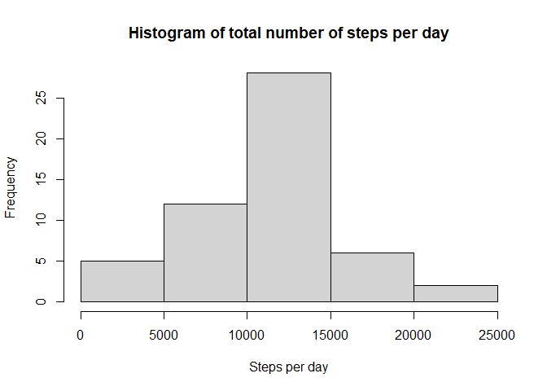
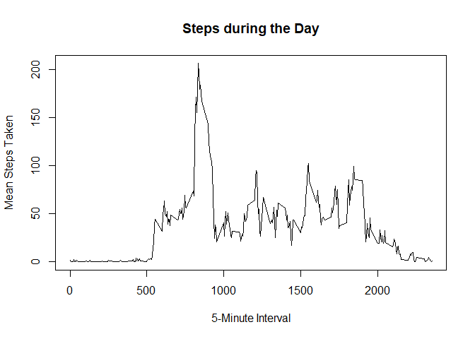
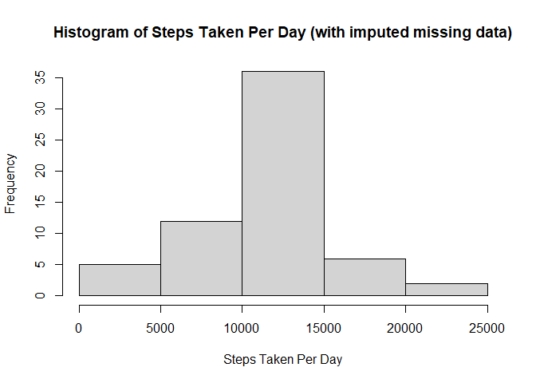
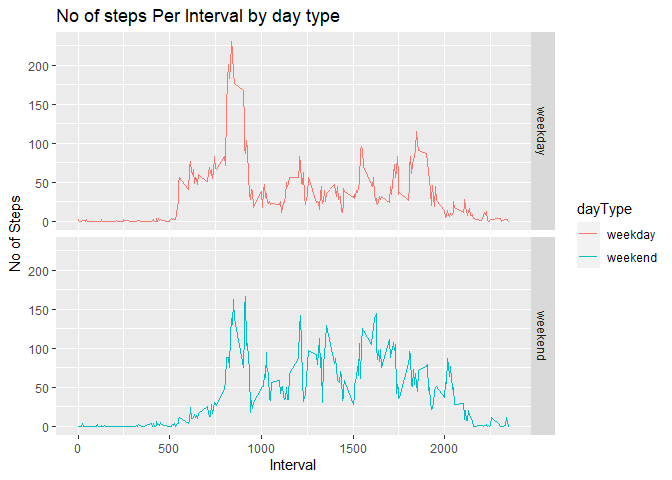

## Loading and preprocessing the data

First we need to load the data from the file.  This assumes that you have the file "activity.csv" in your working directory.


```r
data<-read.csv("activity.csv", as.is = T)
```

## What is mean total number of steps taken per day?

Now we want a histogram of the total number of steps taken each day.

First we'll sum the number of steps by day (ignoring NA values):

```r
#data <- data[complete.cases(data),]
step_Sums<-aggregate(steps ~ date, data, sum, na.rm=T)
colnames(step_Sums)<-c("date","sum") ## give it some meaningful column names
```

Then we'll produce a histogram of this information.


```r
hist(step_Sums$sum, 
     main = "Histogram of total number of steps per day", 
     xlab = "Steps per day")
```

<!-- -->

And then we want the mean and median of these sums of steps per day:

```r
mean(step_Sums$sum)
```

```
## [1] 10766.19
```

```r
median(step_Sums$sum)
```

```
## [1] 10765
```


## What is the average daily activity pattern?

First we want to plot the average number of steps taken across the days for  
the various time intevals.

Calculate the average steps per interval:

```r
interval_Means<-aggregate(steps ~ interval, data, mean, na.rm=T)
colnames(interval_Means)<-c("interval","steps") ## and give those columns meaningful names
```

Then plot the time series data:

```r
plot(interval_Means$interval,interval_Means$steps,type="l", 
     xlab="5-Minute Interval",
     ylab="Mean Steps Taken",
     main="Steps during the Day")
```

<!-- -->

And which interval, on average, had the maximum number of steps?

```r
interval_Means[which.max(interval_Means$steps),]$interval
```

```
## [1] 835
```


## Imputing missing values
How many rows have missing data?

```r
sum(!complete.cases(data))
```

```
## [1] 2304
```

Let's replace those missing values with the mean for the particular five-minute
interval of the row with missing data.

First let's make a copy of the data

```r
data2 <- data
```

Now let's replace the missing data with the appropriate mean.

```r
## Calculate the mean over the given intervals
iMeans<-by(data$steps,data$interval,mean,na.rm=TRUE)

## Then match up the interval to replace the NAs
data2[!complete.cases(data2),1]<-iMeans[as.character(data2[!complete.cases(data2),3])]
```
Now let's redo some of those earlier calculations but on this new data set
that doesn't contain any missing data.

First we'll sum the number of steps by day:

```r
stepSums2<-aggregate(data2$steps,by=list(data2$date),sum)
## column names
colnames(stepSums2)<-c("date","sum")
```
Then we'll produce a histogram of this information.


```r
hist(stepSums2$sum, 
     xlab="Steps Taken Per Day", 
     main="Histogram of Steps Taken Per Day (with imputed missing data)")
```

<!-- -->

And then we want the mean and median of these sums of steps per day:

```r
mean(stepSums2$sum)
```

```
## [1] 10766.19
```

```r
median(stepSums2$sum)
```

```
## [1] 10766.19
```
We note that the mean and the median has NOT changed because of the imputed values


## Are there differences in activity patterns between weekdays and weekends?

We'd like to find out if there are any differences between weekday and weekend activity. So, we're going to add a factor variable to our data set with the filled-in missing values for weekends and weekdays.

First, let's just get the days of the week out of the date column:

```r
days<-weekdays(as.Date(data2$date))
```

Now let's divide that into weekends and not:

```r
weekends<-days=="sábado"|days=="domingo" #I have it in spanish
```
Then we'll transform the days vector into "weekend" or "weekday"

```r
days[weekends]<-"weekend"
days[!weekends]<-"weekday"
```
Add a factor variable to our data set with this information:

```r
data2$dayType<-factor(days)
```

To create our panel plot showing weekday vs weekend activity we need to aggregate the data to calculate the mean number of steps by type of day (i.e., "weekday" or "weekend") and by step interval:


```r
aggMeans<-aggregate(steps ~ interval + dayType, data2, mean)
colnames(aggMeans)<-c("interval","dayType","steps") ## and add column names
```

Load the ggplot library

```r
library(ggplot2)
```

Finally, we want to create a panel plot of this data:

```r
plt <- ggplot(aggMeans, aes(interval, steps)) +
    geom_line(stat = "identity", aes(colour = dayType)) +
    theme_gray() +
    facet_grid(dayType ~ ., scales="fixed", space="fixed") +
    labs(x="Interval", y=expression("No of Steps")) +
    ggtitle("No of steps Per Interval by day type")
print(plt)
```

<!-- -->


